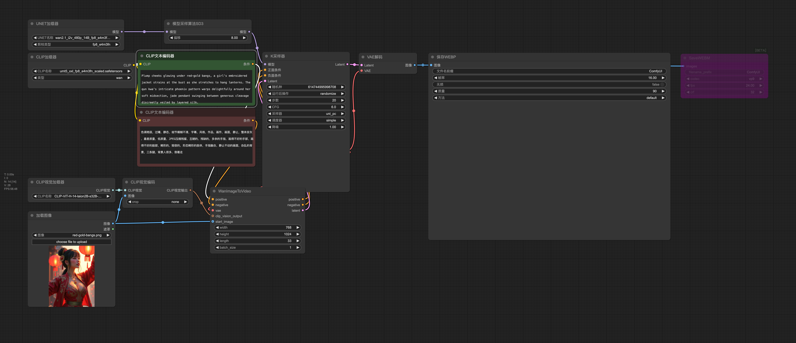
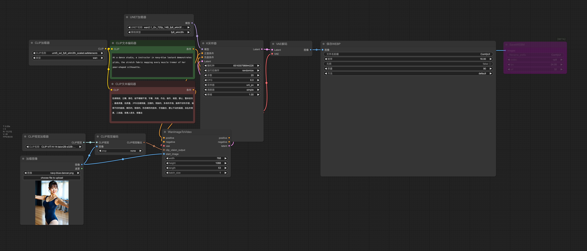
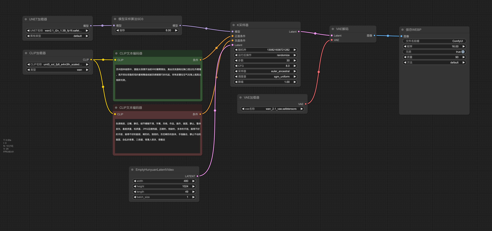
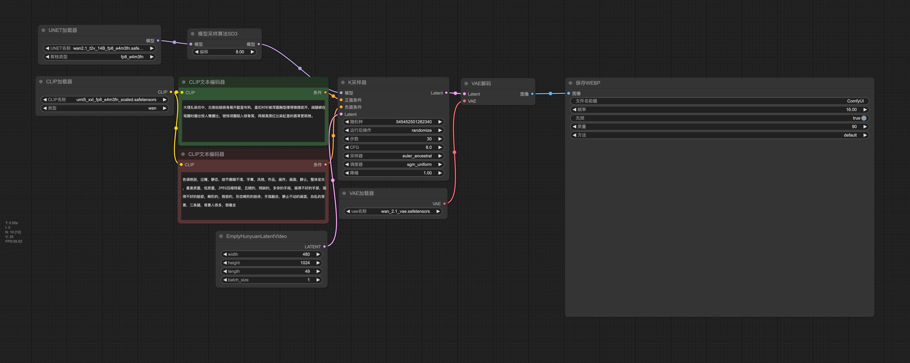

# WAN 2.1 视频生成模型使用指南

WAN 2.1 是一套高质量的视频生成模型系列，支持从文本到视频和从图像到视频的转换。本文档详细介绍模型特性、安装步骤和优化使用方法。

## 模型简介

WAN 2.1 提供两个主要版本：
- **14B 参数版本**：提供最高质量输出，支持 FP8 精度优化
- **1.3B 参数版本**：适合资源有限的设备，保持合理的质量表现

## 核心特性

- 支持多种精度：FP16、BF16、FP8_scaled、FP8_e4m3fn
- 灵活的分辨率支持：从 480P 到 720P
- 可调节帧数输出
- 优化的动画过渡算法
- 精确的文本理解能力

## 技术规格对比

| 参数 | 14B FP8版本 | 1.3B FP16版本 |
|------|------------|-------------|
| 模型大小 | 约7GB | 约2GB |
| 显存要求 | ≥16GB | ≥8GB |
| 推荐GPU | RTX 3090/4090 | RTX 3060及以上 |
| 支持分辨率 | 480P至720P | 主要480P |
| 生成速度 | 较慢 | 较快 |
| 视觉质量 | 优秀 | 良好 |

## 分辨率指南

| 视频方向 | 推荐分辨率 | 用途 |
|---------|----------|------|
| 横向视频 | 1024×576 | 16:9比例，适合一般场景 |
| 竖向视频 | 480×1024 | 9:19.2比例，适合移动设备 |
| 正方形 | 768×768 | 1:1比例，适合社交媒体 |

## 安装要求

### 系统要求
- ComfyUI 最新版本
- Python 3.10 或更高版本
- NVIDIA GPU，支持 CUDA

### 必需文件

#### 文本编码器和 VAE：
- `umt5_xxl_fp8_e4m3fn_scaled.safetensors` - 放置于: `ComfyUI/models/text_encoders/`
- `wan_2.1_vae.safetensors` - 放置于: `ComfyUI/models/vae/`

#### CLIP 视觉模型：
- `CLIP-ViT-H-14-laion2B-s32B-b79K.safetensors` - 放置于: `ComfyUI/models/clip_vision/`

#### 视频扩散模型：
## 模型下载列表

| 模型类型 | 模型文件名 | 大小 | 精度 | 推荐使用 | 备注 |
|---------|----------|------|------|---------|------|
| **文本到视频** | `wan2.1_t2v_1.3B_bf16.safetensors` | 2.84 GB | BF16 |  | 轻量版 |
| **文本到视频** | `wan2.1_t2v_1.3B_fp16.safetensors` | 2.84 GB | FP16 | ✓ | 轻量版，最高质量 |
| **文本到视频** | `wan2.1_t2v_14B_bf16.safetensors` | 28.6 GB | BF16 |  | 高质量版 |
| **文本到视频** | `wan2.1_t2v_14B_fp16.safetensors`  | 28.6 GB | FP16 |  | 高质量版，最佳效果 |
| **文本到视频** | `wan2.1_t2v_14B_fp8_e4m3fn.safetensors` | 14.3 GB | FP8 | ✓ | 显存优化版 |
| **文本到视频** | `wan2.1_t2v_14B_fp8_scaled.safetensors` | 14.3 GB | FP8 |  | 显存优化版，更高质量 |
| **图像到视频(480P)** | `wan2.1_i2v_480p_14B_bf16.safetensors` | 32.8 GB | BF16 |  | 标准分辨率 |
| **图像到视频(480P)** | `wan2.1_i2v_480p_14B_fp16.safetensors` | 32.8 GB | FP16 | ✓ | 标准分辨率，最高质量 |
| **图像到视频(480P)** | `wan2.1_i2v_480p_14B_fp8_e4m3fn.safetensors` | 16.4 GB | FP8 | ✓ | 显存友好版 |
| **图像到视频(480P)** | `wan2.1_i2v_480p_14B_fp8_scaled.safetensors` | 16.4 GB | FP8 |  | 显存友好版，质量更好 |
| **图像到视频(720P)** | `wan2.1_i2v_720p_14B_bf16.safetensors` | 32.8 GB | BF16 |  | 高分辨率 |
| **图像到视频(720P)** | `wan2.1_i2v_720p_14B_fp16.safetensors` | 32.8 GB | FP16 | ✓ | 高分辨率，最高质量 |
| **图像到视频(720P)** | `wan2.1_i2v_720p_14B_fp8_e4m3fn.safetensors` | 16.4 GB | FP8 | ✓ | 高分辨率，显存友好 |
| **图像到视频(720P)** | `wan2.1_i2v_720p_14B_fp8_scaled.safetensors` | 16.4 GB | FP8 |  | 高分辨率，显存友好且质量更好 |

所有扩散模型文件应放置于：`ComfyUI/models/diffusion_models/`

模型质量排名（从高到低）：fp16 > bf16 > fp8_scaled > fp8_e4m3fn

## 工作流示例

### 图像到视频

#### 480P

使用 `wan2.1_i2v_480p_14B_fp8_e4m3fn.safetensors` 模型生成 33 帧视频，分辨率为 768x1024。适合日常使用，对显存要求较低。

#### 720P

使用 `wan2.1_i2v_720p_14B_fp8_e4m3fn.safetensors` 模型生成 53 帧视频，分辨率为 768x1088。处理时间较长但质量更高。

### 文本到视频

#### 1.3B(480P)

使用 `wan2.1_t2v_1.3B_fp16.safetensors` 模型生成 49 帧视频，分辨率为 480x1024。

#### 14B(720P)

使用 `wan2.1_t2v_14B_fp8_e4m3fn.safetensors` 模型生成 49 帧视频，分辨率为 480x1024。

## 参数优化

| 参数类型 | 参数名称 | 推荐值 | 可调范围 | 影响 |
|---------|---------|-------|--------|------|
| 采样器 | 采样方法 | euler_ancestral | 多种算法 | 生成风格和稳定性 |
| 采样器 | 调度器 | sgm_uniform | 多种选项 | 噪声调度方式 |
| 采样器 | 步数 | 30 | 20-50 | 质量与速度平衡 |
| 采样器 | CFG Scale | 8 | 5-12 | 提示词遵循程度 |
| 采样器 | 去噪强度 | 1 | 0.5-1 | 创意自由度 |
| 视频设置 | 帧数 | 49 | 25-100 | 视频长度 |
| 视频设置 | 帧率 | 16 | 8-30 | 播放速度 |
| 视频设置 | 循环播放 | true | true/false | WEBP循环设置 |
| 视频设置 | 质量 | 90 | 50-100 | 输出文件质量 |

## 提示词技巧

### 有效的提示词结构
```
[地点/环境]，[人物特征]，[动作描述]，[服装描述]，[肢体语言/姿态]，[光线氛围]
```

### 示例提示词
```
大理扎染坊中，白族姑娘俯身展开靛蓝布料，盘扣衬衫被浑圆胸型撑得微微绽开，阔腿裤在弯腰时绷出惊人臀腰比，银饰项圈陷入锁骨窝，两颊高原红比染缸里的茜草更明艳。
```

## 优化建议

1. **添加 `ModelSamplingSD3` 节点**：显著提高生成质量，特别是对复杂场景
2. **负面提示词设计**：控制不需要的特征，避免常见生成问题
3. **使用合适的参考图像**：高质量、构图清晰的参考图能提升结果质量
4. **显存管理**：
   - 8GB 显存：使用 fp8 模型生成短片段 480P 视频
   - 16GB 显存：可使用 fp16 模型生成 720P 视频
   - 24GB+ 显存：可生成更长时间的高质量 720P 视频

## 常见问题

1. **显存不足**：尝试使用 fp8 模型、减少帧数或降低分辨率
2. **生成质量不佳**：检查提示词质量和参考图像清晰度，增加采样步数
3. **生成速度慢**：视频生成是计算密集型任务，可在不需要最高质量时使用轻量级模型
4. **选择合适模型**：根据硬件和需求选择 - 追求质量选 14B 版本，优先考虑速度选 1.3B 版本
